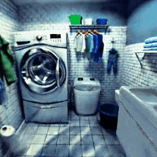
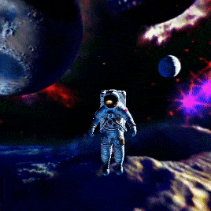

# SceneWiz3D

This repository is the official implementation of [SceneWiz3D]().

 <table class="center">
    <tr style="line-height: 0">
      <td width=30% style="border: none; text-align: center">A bedroom, with large windows revealing sunset outside, Ukiyo-e style </td>
      <td width=30% style="border: none; text-align: center">A washing room, realistic photo</td>
      <td width=30% style="border: none; text-align: center">An astronaut in the mysterious space</td>
    </tr>
    <tr style="line-height: 0">
      <td width=30% style="border: none"></td>
      <td width=30% style="border: none"></td>
      <td width=30% style="border: none"></td>
    </tr>
 </table>

> [SceneWiz3D: Towards Text-guided 3D Scene Composition]()
> 
> Qihang Zhang, Chaoyang Wang, Aliaksandr Siarohin, Peiye Zhuang, Yinghao Xu, Ceyuan Yang, Dahua Lin, Bolei Zhou, Sergey Tulyakov, Hsin-Ying Lee

 

 **This paper is currently in the "on hold" status on Arxiv. Hopefully Arxiv posts it soon, but for now it's just hosted on our project website. You can find PDF at [here](https://zqh0253.github.io/SceneWiz3D/media/scenewiz3d.pdf).**

More to come. Stay tuned!
